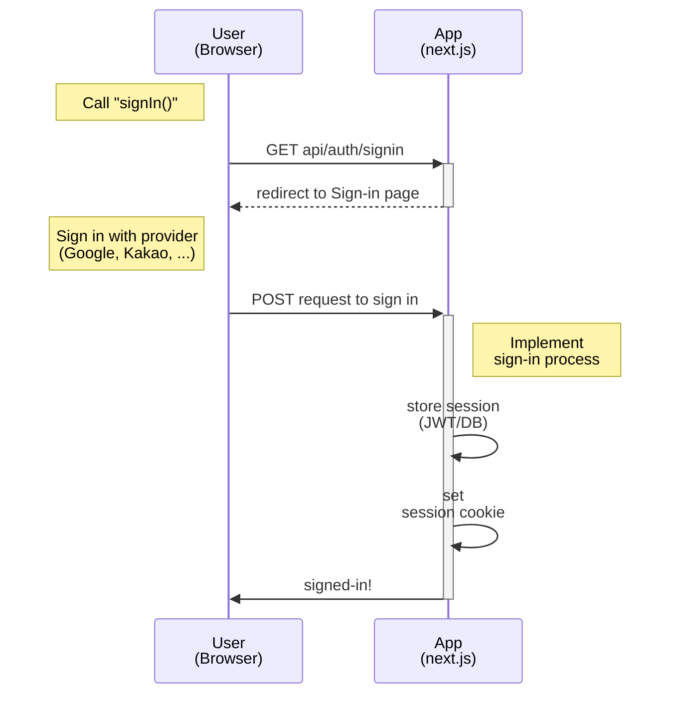
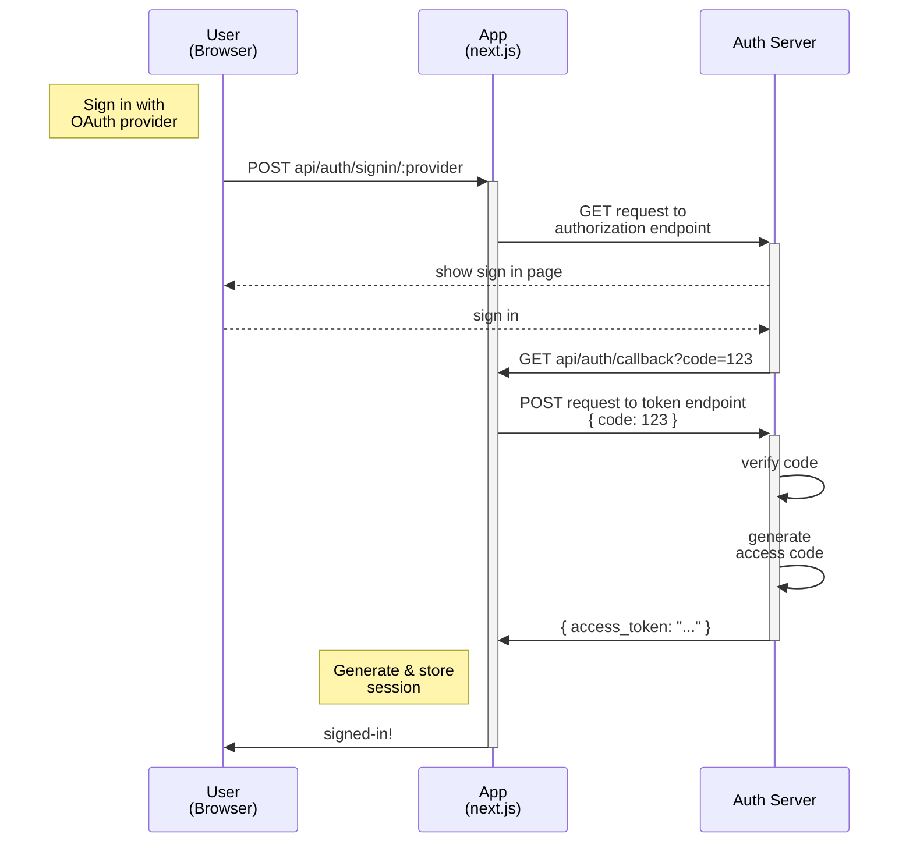
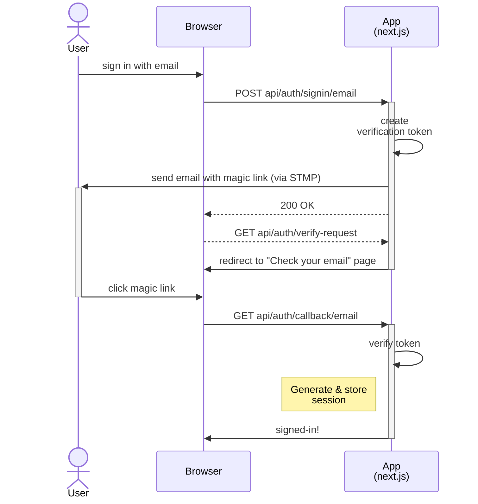
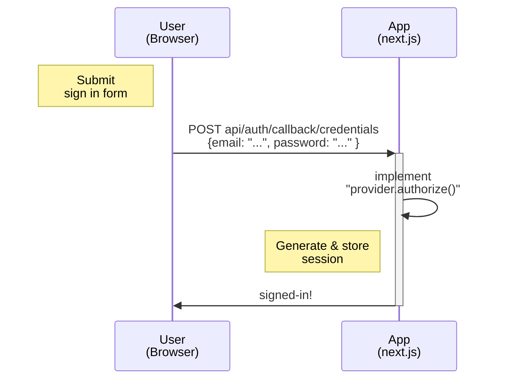

# [Topic 01] NextAuth

`next-auth`를 활용한 로그인 구현 샘플

## Tech Stack

- Node 18
- React 19
- Next.js 15
- NextAuth 4

## Getting Started

```bash
pnpm install

pnpm dev # run server in development mode (http://localhost:3000)

# or
pnpm build # build the app
pnpm start # run server in production mode (http://localhost:3000)
```

### Before Started

로그인 기능을 사용하려면 `.env.local`에 아래 내용 추가 필요 ([.env.local.example](./.env.local.example) 참고)

```bash
# .env.local
NEXTAUTH_URL=canonical-url-here # production mode에서 테스트하려면 추가 필요
AUTH_SECRET=your-secret-here # CLI에서 `npx auth secret` or `openssl rand -hex 32` 실행해 추가

# For GitHub OAuth authentication
# https://authjs.dev/guides/configuring-github
AUTH_GITHUB_ID=github-client-id-here
AUTH_GITHUB_SECRET=github-client-secret-here

# For Email authentication
# https://next-auth.js.org/providers/email#smtp
EMAIL_SERVER=smtp-server-here
EMAIL_FROM=sender-email-here
```

## NextAuth?

Next.js에서 쉽게 인증을 구현할 수 있는 오픈소스 라이브러리.

### 핵심 기능

- OAuth, Email, Credential 등 다양한 인증 방식 지원
- 세션 관리
  - JWT/데이터베이스를 활용한 세션 관리 지원
  - Double Submit Cookie 패턴을 통한 보안 강화
  - `useSession()`, `signIn()`, `signOut()` 등 Client-side API와 `getServerSession()`, 미들웨어 등 Server-side API 제공
- 다양한 Built-in 기능을 활용한 쉬운 연동
  - OAuth Provider: Google, Kakao, Naver, ...
  - Adapter: Prisma, MongoDB, Firebase, ...
  - 페이지: 로그인, 로그아웃, ...

### 핵심 개념

#### Provider

NextAuth가 사용자 인증을 처리할 수 있도록 인증 수단을 설정하는 객체

**인증 수단**

- OAuth: 구글, 카카오 등 타사 웹사이트/어플리케이션을 통한 인증
- Email: 매직 링크를 이용한 패스워드리스 인증
- Credentials: 패스워드를 이용한 전통적인 인증

#### Adapter

사용자, 세션, 이메일 인증 토큰 등을 저장하는 데이터베이스와 연결해주는 객체

#### Session Strategy

- `jwt`: 세션 정보를 JWT로 인코딩하고 세션 쿠키(`next-auth.session-token`)에 저장해 서버 상태 없이 관리 (stateless)
- `database`: 세션 정보를 데이터베이스에 저장하고 세션 쿠키에 세션 ID만 담아 서버 상태 기반으로 관리 (stateful)

#### CSRF 토큰

next-auth는 세션 정보를 쿠키에 저장하기 때문에 CSRF(Cross-Site Request Forgery, 사이트 간 요청 위조) 공격에 취약할 수 있다. 이에 대한 방어책으로 next-auth는 별도의 토큰을 쿠키에 저장하고 로그인/로그아웃과 같은 POST 요청시 페이로드에 포함된 토큰과 비교해 유효성을 검증한다. 이러한 방식을 **Double-Submit Cookie 패턴**이라 하며, 이때 사용하는 토큰을 **CSRF 토큰**이라고 한다.

### 인증 플로우

next-auth는 모든 인증 방식에서 공통적으로 아래의 플로우를 따른다.



각 인증 방식에 따른 인증 플로우는 아래와 같다.

<details>
<summary>OAuth</summary>



</details>

<details>
<summary>Email</summary>



</details>

<details>
<summary>Credentials</summary>



</details>

## 실전 적용 가이드

1. [커스텀 로그인 페이지](./docs/custom-signin-page.md)
2. [`database` 세션 관리 기반 Credentials 인증](./docs/credentials-with-db.md)
3. [백엔드 API 연동](./docs/intergation-with-backend-api.md)
