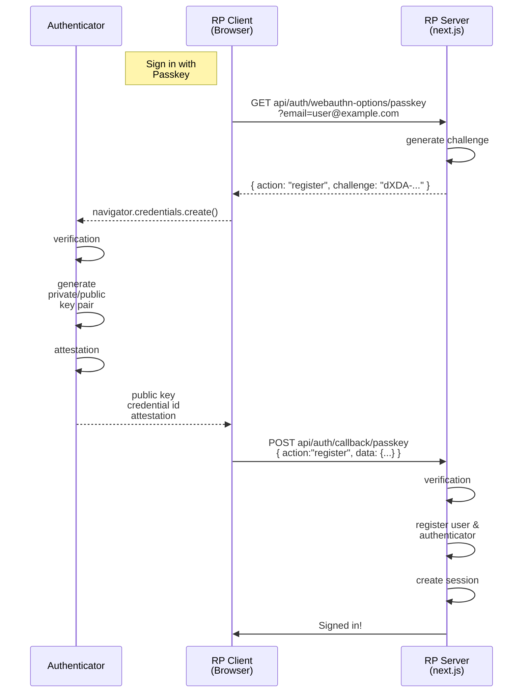
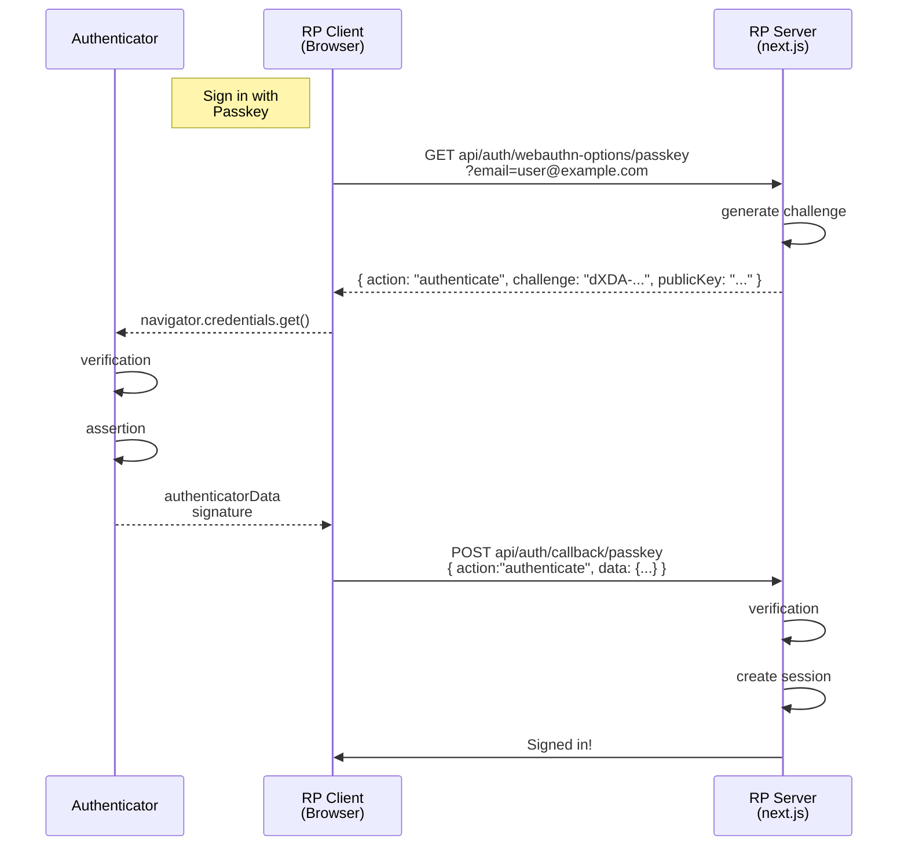

# WebAuthn - 패스키(Passkey) 인증

Auth.js(구 NextAuth)의 메이저 버전이 5로 올라가면서 패스키 인증이 실험적 기능으로 추가되었다. 패스키 인증이란 비밀번호 없이 웹사이트나 앱에 로그인할 수 있는 방법으로, WebAuthn을 기반으로 한 사용자 친화적인 인증 방식이다.

## WebAuthn (Web Authentication)

WebAuthn이란 사용자가 웹에서 FIDO2 기반의 인증을 할 수 있도록 W3C에서 표준화한 웹 API이다. FIDO(Fast IDentity Online)는 비밀번호가 필요 없는 인증 환경을 목표로 하며, 사용자의 생체 정보나 보안 장치와 같은 사용자 고유 정보를 이용한 인증 프로토콜이다. FIDO2는 기존 모바일 중심이던 FIDO에서 WebAuthn API와 CTAP을 더해 웹 브라우저와 보안 장치 간 통신을 지원하도록 확장된 스펙이다.

> **CTAP(Client to Authenticator Protocol)**
>
> CTAP은 웹 브라우저(클라이언트)와 외부 인증기(Authenticator) 간의 통신을 정의한 FIDO2의 핵심 구성 요소 중 하나다.
>
> 예를 들어, 사용자가 보유한 USB 보안 키, NFC 장치, 또는 스마트폰이 인증기로 동작할 때, 이 장치와 클라이언트 간의 데이터 교환을 CTAP이 처리한다.

### 핵심 용어

#### Relying Party(RP)

인증을 요청하는 주체, 즉 서비스 제공자. WebAuthn API를 호출하는 클라이언트 사이드 컴포넌트와 인증 관련 작업들(RP Operations)을 실행하는 서버 사이드 컴포넌트로 구성되고, 두 컴포넌트는 https 혹은 그와 비슷한 수준 보안 프로토콜을 통해 통신해야 한다.

#### RP ID

Relying Party를 식별하기 위한 유효한 도메인 문자열. 오리진의 **"effective domain"**와 같거나, 그 하위 도메인을 RP ID로 사용할 수 있다.

| 오리진                    | RP ID                  |
| ------------------------- | ---------------------- |
| http://localhost:3000     | ✅ localhost           |
| https://login.example.com | ✅ example.com         |
| https://login.example.com | ✅ login.example.com   |
| https://login.example.com | ❌ another.example.com |

#### Challenge

재전송 공격(Replay attack)을 막기 위해 사용자 등록/인증시 RP에서 생성하는 난수값.

#### Authenticator

사용자의 private key를 저장하고 서명 연산을 수행하는 하드웨어 혹은 소프트웨어.

#### Attestation

사용자 등록 시, 인증기가 생성한 공개키와 자신이 신뢰할 수 있는 장치임을 attestation signature로 증명하는 절차.

#### Assertion

사용자 인증 시, 인증기가 개인키로 서버에서 받은 챌린지에 서명하여 “내가 이 credential의 소유자”임을 증명하는 절차.

## 등록/인증 플로우

### 등록

### 인증

## References

- [FIDO2: 웹 인증(WebAuthn)](https://fidoalliance.org/fido2-2/fido2-web-authentication-webauthn/?lang=ko)
- [FIDO1 와 FIDO2 차이점 알아보기](https://tech.sungbinlee.dev/security/fido-vs-fido2/)
- [Web Authentication: An API for accessing Public Key Credentials Level 2](https://www.w3.org/TR/webauthn-2/)
- [FIDO2, WebAuthn 과 CTAP](https://ideatec.co.kr/passkeynews/?bmode=view&idx=6121568)
