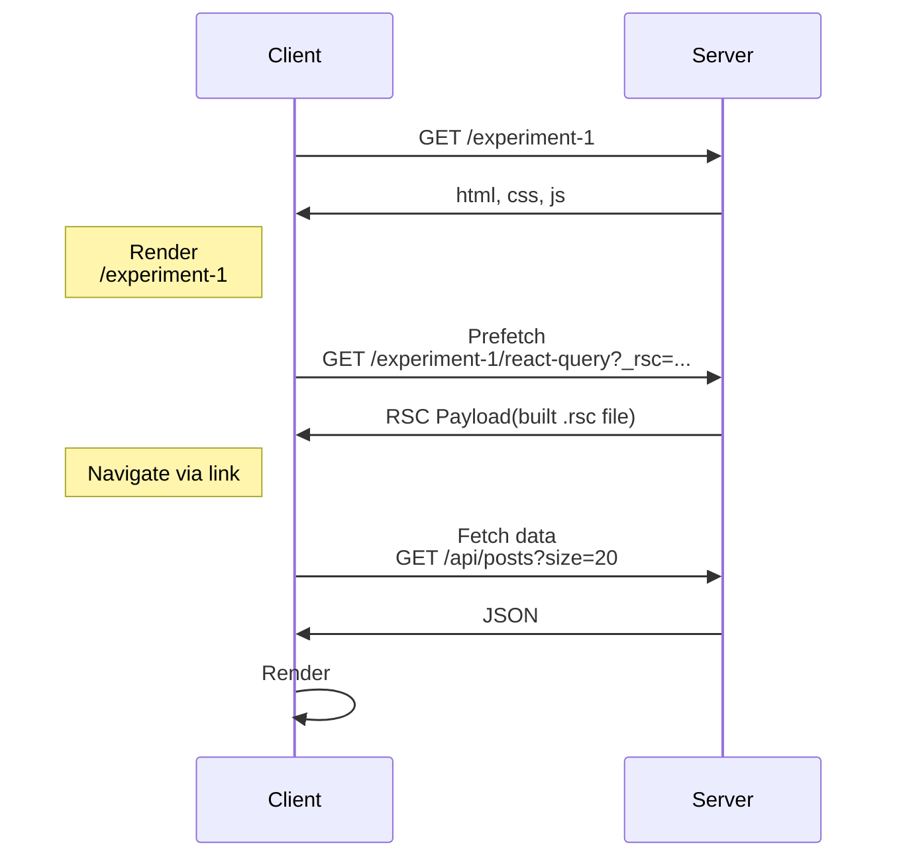
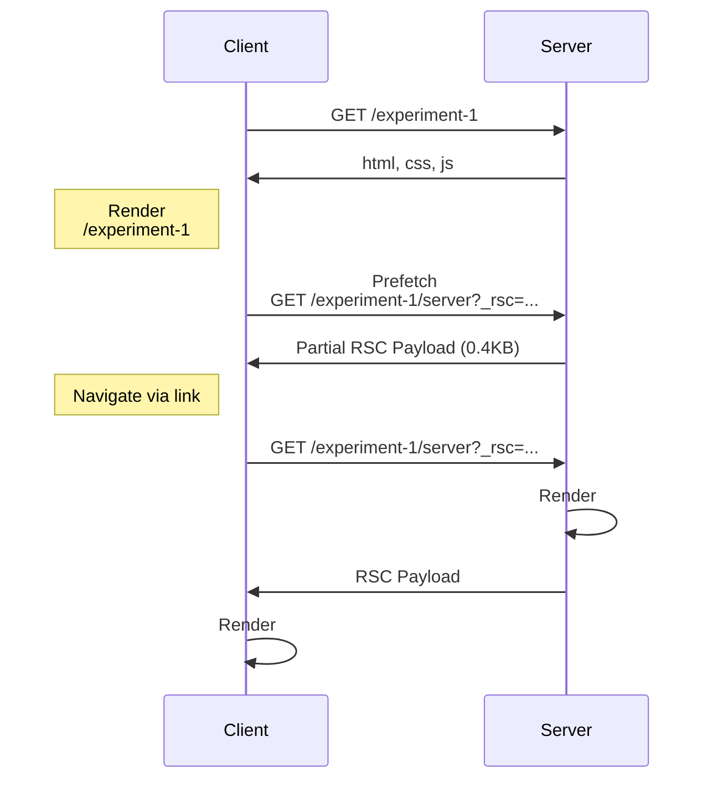
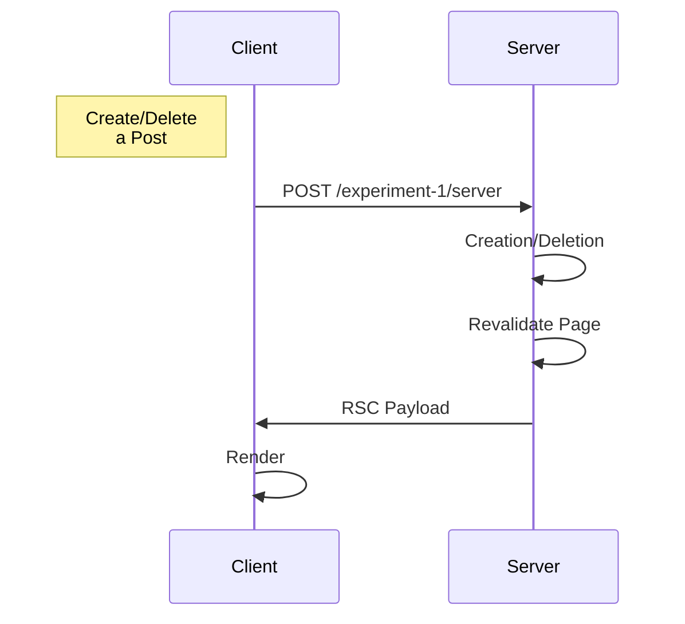
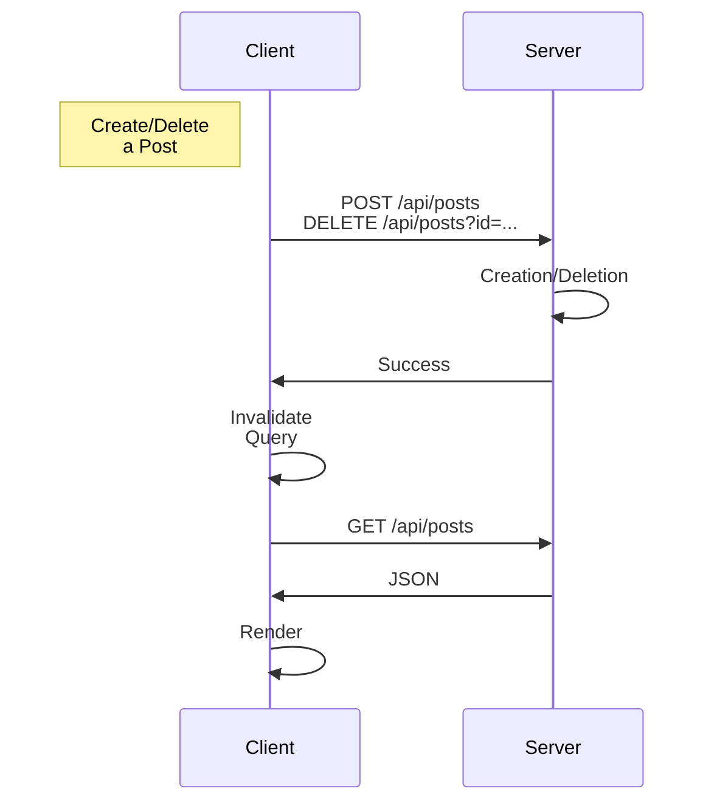

# Experiment 1. Sort & Mutation

RSC(+ 서버 액션)과 React Query를 사용해 정렬과 데이터 변경(Mutation)을 각각 구현하고, 두 방식의 동작 원리를 비교해보는 실험이다.

실험을 위해 RSC로 구현한 페이지와 React Query로 구현한 페이지 두 개를 준비하고, 두 페이지는 다음의 공통 기능을 가진다.

- 20개의 게시물 목록 렌더링
- 게시물 목록 정렬 (오름차순/내림차순)
- 새 게시물 추가
- 각 게시물 삭제

## Implementation

### RSC & Server Actions

RSC를 통해 서버 사이드에서 데이터를 받아 목록을 그려 클라언트에서 내려주고, 게시물이 추가/삭제되면 `revalidatePath("/experiment-1/server")`을 호출해 서버에서 페이지를 다시 그려 내려준다. 이때 `revalidatePath` 함수에 인자를 넘겨줄 때 쿼리 파라미터를 따로 넘겨주지 않아도 되는데, 이는 Next.js의 서버 액션에 대한 처리 방식 때문으로 보인다.

네트워크 패널로 확인해보면, 추가/삭제 버튼을 눌러 폼을 제출할 때 현재 페이지 URL에 포함된 쿼리 파라미터까지 유지된 채 POST 요청이 전송된다. Next.js는 이 요청을 처리하면서 서버 액션을 실행하고, `revalidatePath`를 호출할 때 해당 POST 요청에 포함된 쿼리 파라미터를 기반으로 서버에서 페이지를 다시 렌더링한다.

### React Query (`useMutation`)

페이지를 RCC(React Client Component)로 만들고, React Query의 `useQuery`를 사용해 클라이언트(브라우저)에서 게시물 목록을 가져온다. 이때 **쿼리 키(Query Key)**에는 쿼리 파라미터를 포함해, 정렬 방식이 변경되면 목록을 새로 받아온다.

추가/삭제의 경우 `useMutation`을 사용한다. 역시 클라이언트에서 백엔드 API를 호출하며, 성공적으로 응답을 받으면 해당 게시물 목록을 캐시에서 무효화(invalidate)하여 데이터를 다시 가져온다.

## Analysis (on localhost on production mode)

### 첫 페이지 로드

**Response Size - URL Navigation**

|          Requests           |  `/server`  | `/react-query` |
| :-------------------------: | :---------: | :------------: |
|          Document           |   18.2KB    |     7.2KB      |
| JS files (Total/Unique) | 134KB/4.7KB |  141KB/9.5KB   |
|          API call           |     --      |      10KB      |

주소창에 URL을 입력해 사이트에 접속했을 때 발생하는 응답 사이즈를 정리한 테이블이다. html 파일(`Document`)의 경우, 서버에서 모든 컨텐츠를 생성하는 `/server` 페이지가 클라이언트에서 리스트를 렌더링하는 `/react-query` 페이지보다 약 2.5배 크다.

반면 JS 파일의 경우, 공통 파일을 제외하면 `/react-query` 페이지가 `/server` 페이지보다 약 2배 더 크다. 하지만 `/server` 패아자애눈 `/react-query`와 달리, `/experiment-2` 페이지에 사용되는 JS 파일이 미리 로드된다. 미리 로드되는 파일을 제외하면 `/server` 페이지에서만 사용하는 JS 파일은 총 2.3KB로, `/react-query` 페이지의 약 1/4배 수준이다.

**Response Size - Link Navigation from `/experiment-1`**

|              Requests              |      `/server`      | `/react-query` |
| :--------------------------------: | :-----------------: | :------------: |
| RSC Payload (Preloaded/Loaded) | 0.4KB/1.3KB ~ 2.7KB |   4.8KB/0KB    |
|  JS files (Preloaded/Loaded)   |       0KB/0KB       |   9.5KB/0KB    |
|              API call              |         --          |      10KB      |

`/experiment-1` 페이지에서 링크를 눌러 페이지를 이동했을 때 발생하는 응답 사이즈를 정리한 테이블이다. 주소창 입력과 달리, 내부 페이지에서 링크를 눌러 페이지를 이동할 경우 Next.js는 html 파일 대신 **RSC 페이로드**를 응답으로 내려준다. `/server` 페이지의 경우, `/experiment-1` 페이지가 로드된 후 `<Link />`의 **prefetch** 기능을 통해 0.4KB의 RSC 페이로드가 사전 로드된다. 이후 링크를 눌러 페이지를 이동하면 1.3KB에서 2.7KB 사이의 페이로드가 추가로 전달된다. 반면 `/react-query` 페이지의 경우, `/experiment-1` 페이지가 로드된 직후 약 4.8KB의 RSC 페이로드가 사전 로드되며, 이후 페이지 이동 시에는 추가 페이로드가 전송되지 않는다.

JS 파일의 경우, `/server` 페이지는 서버 컴포넌트로만 구성되어 있어 페이지 이동 전후로 별도의 JS 파일이 전송되지 않는다. 반면, `/react-query` 페이지는 클라이언트 컴포넌트를 포함하고 있어 9.5KB의 JS 파일이 사전 로드되며, 이후 페이지 이동 시 추가로 로드되는 JS 파일은 없다.

두 페이지의 동작이 다른 이유는 Next.js에서 동적 페이지와 정적 페이지를 처리하는 방식의 차이에서 비롯된 것으로 보인다. `/server` 페이지는 리스트를 가져오기 위해 사용하는 `fetch()` 함수에 `no-store` 캐시 전략이 적용되어 항상 서버에서 동적으로 페이지가 생성된다. 반면 `/react-query` 페이지의 경우 `fetch()` 함수의 캐시 전략이 동일하지만 클라이언트에서 함수가 호출되기 때문에 기본값인 정적 페이지로 생성된다.

`next build`를 통해 애플리케이션을 빌드하면 `.next/` 폴더에 정적 페이지로 처리된 `/react-query` 페이지의 `.html` 및 `.rsc` 파일이 생성된다. 생성된 `.rsc` 파일은 클라이언트에서 prefetch 요청이 발생할 경우, 서버가 해당 파일을 JS 번들 파일과 함께 그대로 응답으로 전송한다. 링크를 눌러 페이지를 이동하면 미리 받아둔 RSC 페이로드와 JS 파일을 사용해 UI를 그린다.

반면 동적 페이지인 `/server` 페이지의 경우, `next build` 시 `.next/` 폴더에 `.html`, `.rsc` 파일이 생성되지 않는다. 대신, 매 요청마다 서버에서 페이지를 렌더링해 HTML 혹은 RSC 페이로드 형태로 응답을 전송한다. 참고로 로컬호스트 기준으로 두 페이지의 HTML, RSC 페이로드의 응답 시간은 아래와 같으며, 이 응답 시간의 차이 또한 정적/동적 페이지 처리 방식의 차이에서 비롯된 것으로 보인다.

|  Requests   | `/server` | `/react-query` |
| :---------: | :-------: | :------------: |
|    HTML     | avg 20ms  |    avg 5ms     |
| RSC Payload | avg 17ms  |    avg 3ms     |
|  API call   |    --     |    avg 3ms     |

### 정렬

**`/server`**

|           Requests           |     Size      |   Time   |
| :--------------------------: | :-----------: | :------: |
|         RSC Payload          | 1.4KB ~ 2.6KB | avg 15ms |
| RSC Payload (Prefetched) |     0.4KB     | avg 3ms  |

정렬 버튼을 누르면 기존 페이지 URL에 쿼리 파라미터 `sort`가 추가/변경 되면서 서버에 새로운 페이지 요청을 보낸다. 서버는 요청을 받으면 페이지를 만들어 RSC 페이로드를 응답으로 내려준다. 또한 정렬 버튼은 `<Link />`로 구현되어 있기 때문에, 버튼을 눌러 URL이 바뀌면 변경된 URL에 대해 사전 요청을 보낸다.

**`/react-query`**

|  Requests   | Size  |  Time   |
| :---------: | :---: | :-----: |
| RSC Payload | 4.8KB | avg 7ms |
|  API Call   | 10KB  | avg 3ms |

`/react-query` 페이지 역시 정렬 버튼을 누르면, 서버에 새로운 페이지 요청을 보내고 서버는 RSC 페이로드를 응답으로 내려준다. 이 때 응답은 쿼리 파라미터 값과 상관없이 `.next` 폴더에 빌드된 `.rsc` 파일을 사용한다. 또한 클라이언트 측에서 URL의 `sort` 파라미터가 변경되면서, 해당 정렬 기준에 맞는 데이터를 가져오기 위한 API 요청도 함께 발생한다.

### 추가/삭제

**`/server`**

|    Requests    |     Size      |   Time   |
| :------------: | :-----------: | :------: |
| Server Actions | 2.7KB ~ 4.2KB | avg 20ms |

버튼을 눌러 추가/삭제를 누르면 동일한 페이지 URL로 `POST` 요청을 서버에 보낸다. 서버는 요청을 받으면 서버 액션을 실행해 아이템을 추가/삭제 후 페이지를 재생성해 RSC 페이로드를 응답으로 내려준다.

**`/react-query`**

| Requests | Size  |  Time   |
| :------: | :---: | :-----: |
|   POST   | 0.8KB | avg 5ms |
|  DELETE  | 0.2KB | avg 8ms |
|   GET    | 10KB  | avg 3ms |

`react-query` 페이지의 경우, 추가/삭제에 해당하는 API 요청(`POST`/`DELETE`)을 보낸다. 요청에 성공하면 클라이언트에서 리스트를 다시 가져오기 위해 `GET` 요청을 보내고, 응답을 기반으로 리스트를 다시 렌더링한다.

두 페이지 간 응답 시간을 비교해보면, `/server` 페이지는 평균 약 20ms, `/react-query` 페이지는 평균 8~11ms 소요된다. `/react-query` 페이지는 **Optimistic Update**를 도입해 리스트를 다시 받기 전에 UI를 먼저 업데이트 할 수 있으므로, 데이터 변경이 빈번한 페이지라면 React Query 기반의 Client Fetching 방식 도입을 긍정적으로 고려할 수 있다.
